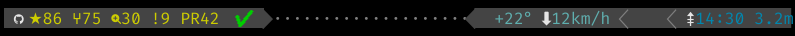
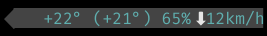

# TideReport Fish Shell Plugin
A collection of clean, asynchronous, and highly configurable prompt sections for the [Tide](https://github.com/IlanCosman/tide) prompt for Fish shell.

TideReport provides rich prompt items that display **Weather**, **Moon Phase**, **Ocean Tides**, and **GitHub** repository data. Built with performance in mind, it fetches everything in the background so your shell stays lightning-fast.

## ✨ Key Features
- 🚀 **Zero-Lag Performance**: Uses asynchronous background fetches. Your prompt will _never_ hang waiting for a network request.
- 🧙‍♂️ **Interactive Setup**: Comes with a built-in installation wizard to easily configure your layout, units, and locations right in your terminal.
- 🧩 **Modular**: Completely independent modules. Use all of them, or just pick your favorites.
- 🎨 **Highly Configurable**: Easily tweak colors, icons, formats, refresh rates, and data providers to match your aesthetic.
- 💁 **Helpful**: Provides succinct weather data, moon phase data, GitHub stats, or if you really want to lean into the maritime theme, tide data.

## 👀 Previews




_Maintainers: regenerate committed preview PNGs with `fish scripts/generate_prompt_previews.fish`. Tune segment colors, Powerline glyphs, and fonts in `scripts/prompt_preview_appearance.fish`. Requires a [Nerd Font](https://www.nerdfonts.com/) and ImageMagick or rsvg-convert; the script creates `scripts/.preview-venv` with [termtosvg](https://github.com/nbedos/termtosvg) on first run. Repo-only — not installed by Fisher._

## ⚡ Quick Start
### 1. Requirements
Before installing, make sure you have the following available on your system:
- **`curl`**: Required by the `weather` and `tide` modules. The default `moon` provider (`local`) does not use the network; `curl` is only needed if you set `tide_report_moon_provider` to `wttr`.
- **`jq`**: **Required by all modules** for parsing JSON data.
- **`gh`**: The [GitHub CLI](https://cli.github.com/), only required if you want to use the `github` module. Remember to authenticate (`gh auth login`).
- The latest version of [Fish](https://fishshell.com/) and the [Fisher](https://github.com/jorgebucaran/fisher) plugin manager.
- A **Nerd Font** (Recommended for rendering icons properly). You can download and install one directly from [https://www.nerdfonts.com/font-downloads](https://www.nerdfonts.com/font-downloads), or use your system's package manager to install a widely available package like `ttf-firacode-nerd` or `font-fira-code-nerd-font`.

### 2. Installation & Setup Wizard
Install the plugin using [Fisher](https://github.com/jorgebucaran/fisher):

```fish
fisher install MrBasa/TideReport@v1
```

If you are installing in an interactive terminal session, the **TideReport Installation Wizard** will automatically launch to walk you through the setup:

1. **Choose Units**: Select Metric (°C, km/h, meters) or US/Imperial (°F, mph, feet).

2. **Preview & Select Modules**: The wizard will show live previews of the GitHub, Weather, Moon, and Tide modules. You will be prompted to choose `[Y/n]` to add each one to your prompt.

3. **Configure Weather**: If enabled, choose a display format (Concise, Medium, or Detailed).

4. **Set Location**: The wizard will show two weather-location modes. IP-based auto-detect uses your current network/IP and can change when you move, switch networks, or use a VPN. If you want weather pinned to one place, enter a fixed city, postal code, or GPS coordinates instead.

The plugin automatically runs `tide reload` when finished, so your new prompt items will appear immediately!

_(Note: If you install non-interactively, or choose to skip the wizard, the plugin defaults to adding GitHub, Weather, and Moon with standard settings.)_

### 3. `tide-report` CLI
Re-run the configuration wizard or check the plugin version without reinstalling:

```fish
tide-report configure    # interactive wizard (same as install/update wizard)
tide-report doctor       # check enabled items for missing tools or bad config (stderr)
tide-report bug-report   # copy-friendly snapshot for GitHub issues (stdout)
tide-report --help
tide-report --version
```

`doctor` and install/configure only run checks for TideReport items actually present in `tide_left_prompt_items` / `tide_right_prompt_items`. They never run on the live prompt path. Warnings go to **stderr**; exit status is `0` unless the command itself fails. Use `tide-report doctor --quiet` to omit informational lines (warnings only).

Open-Meteo fixed locations are validated in `doctor` when `weather` is enabled; **wttr** locations are not validated in doctor v1.

On `fisher update`, TideReport **clears all module caches** under `~/.cache/tide-report/` (weather, moon, tide, GitHub, IP location, and lock files) before re-running install logic. This avoids stale schema or bad cache files after an upgrade but means modules may show unavailable briefly until background fetches complete.

The update wizard prompt defaults to **no** (press Enter to skip re-configuration). On first install it defaults to **yes**. Run `tide-report configure` anytime to re-run the wizard. After changing options with `set -U`, run `tide reload` so Tide picks up prompt layout changes.

### 4. Declarative Configuration (Dotfiles)
If you prefer to manage your plugins declaratively, you can add `MrBasa/TideReport@v1` to your `~/.config/fish/fish_plugins` file and run `fisher update`. The same interactive wizard will appear if you run this in an interactive session.

## 📦 Available Modules Overview
|**Module**|**Description & Example**|
|---|---|
|**`github`**|Displays stars, forks, watchers, issues, pull requests, and the latest CI workflow status for your current Git repository.|
|**`weather`**|Displays the current weather using Open-Meteo (default) or wttr.in.|
|**`moon`**|Displays the current moon phase using a fast, local, offline astronomical model (no network calls required!).|
|**`tide`**|Displays the next high or low tide time and water level from NOAA (US-based stations).|

# 🛠️ Advanced Configuration & Technical Details
The following sections are for users who want to manually tweak their prompt, change default behaviors, or understand how TideReport works under the hood. Set any of the following variables universally (e.g., `set -U tide_report_units "m"`) or add them to your `config.fish` to override defaults.

## 🎛️ Manual Prompt Management
If you skipped the wizard or want to manually change the order of your items, you can edit the Tide prompt lists and reload:

```fish
set -Ua tide_right_prompt_items tide
tide reload
```

## ⚡ Caching Behavior
To keep your prompt fast, this plugin fetches data in the background and relies on file-based cached data (stored in `~/.cache/tide-report/`).

### Timers: Stale vs. Invalid
Modules use an asynchronous caching system with two timers:

1. **Refresh (`..._refresh_seconds`)**: The "stale" timer. If data is older than this value, the prompt **shows the stale data** and triggers a silent background fetch. Your prompt is never blocked.

2. **Expire (`..._expire_seconds`)**: The "invalid" timer. If data is older than this value (or doesn't exist), the prompt **shows the unavailable text** (e.g., `🌊…`) and triggers a background fetch.

**It is expected behavior to see the "unavailable" text for a few seconds** when opening a terminal for the very first time, or after your cache has completely expired.

## 📓 Diagnostic Log
Expected issues (missing dependencies, bad GitHub credentials, API timeouts, invalid weather locations) are written silently to a log file so your prompt is never delayed by I/O.
- **Location**: `$XDG_STATE_HOME/tide-report/tide-report.log` (or `~/.local/state/tide-report/tide-report.log`).
- **When to look**: If a prompt item consistently shows its "unavailable" text (e.g. `…` or `🌊…`), check this file.

## ⚙️ Global Settings
|**Variable**|**Description**|**Default**|
|---|---|---|
|`tide_report_service_timeout_millis`|Timeout for all web requests, in milliseconds.|`6000`|
|`tide_report_wttr_url`|URL for [wttr.in](https://wttr.in/), used for weather (wttr) and moon.|`https://wttr.in`|
|`tide_report_weather_provider`|Weather backend: `wttr` or `openmeteo`.|`openmeteo`|
|`tide_report_units`|Units for weather and tide: `m` (Metric), `u` (USCS)|`m`|
|`tide_time_format`|Time format string for Tide prompt times (also used by tide items).|`"%H:%M"` when unset|
|`tide_report_user_agent`|HTTP User-Agent sent to external APIs (includes plugin version).|`tide-report/<version>`|
|`tide_report_log_expected`|Set to `0`, `false`, or `no` to disable diagnostic logging.|`1`|

## 🤖 GitHub Module (`github`)
Displays stats for the current repository. **Requires `gh` CLI to be authenticated.** The item is only shown when the repo's `origin` remote is on GitHub; in other git repos (e.g. GitLab) the item is hidden.

|**Symbol**|**Meaning**|
|---|---|
|`★` / `⑂` / ``|Stars / Forks / Watchers|
|`!` / `PR`|Open Issues / Open Pull Requests|
|`✔` / `✗` / `⏳`|Latest workflow run on the current branch: pass / fail / in progress (or queued)|
|`!auth`|`gh` CLI is not authenticated|

CI status comes from `gh run list` (latest run on your current branch). GitHub reports in-progress runs as `in_progress`, not the word `running`. Data is cached in the background so the prompt never blocks.

- **Fresh** (age ≤ `tide_report_github_ci_refresh_seconds`, default 60s): show cached pass / fail / pending.
- **Stale** (older than refresh but not expired) **or** while a CI fetch is running: show `⏳` only — not the last pass/fail.
- **Expired** (older than `tide_report_github_ci_expire_seconds`, default 180s) with no fetch in progress, or no CI cache yet: **no CI icon** (repo stats still show).

While a run is active (cached `pending` or a CI fetch in progress), refresh uses `tide_report_github_ci_running_refresh_seconds` (default 5s) so the hourglass updates sooner. Repository stats use `tide_report_github_refresh_seconds` only (no separate expire tier).

|**Variable**|**Description**|**Default**|
|---|---|---|
|`tide_github_color`|Prompt item text color.|`white`|
|`tide_github_bg_color`|Prompt item background color.|`(theme default)`|
|`tide_report_github_icon`|Leading GitHub segment icon.|``|
|`tide_report_github_icon_*`|Icons for `stars`, `forks`, `watchers`, `issues`, `prs`.|`★`, `⑂`, ``, `!`, `PR`|
|`tide_report_github_color_*`|Colors for `stars`, `forks`, `watchers`, `issues`, `prs`.|`yellow`|
|`tide_report_github_show_ci`|Show latest workflow run for the current branch.|`true`|
|`tide_report_github_icon_ci_*`|Icons for CI states: `pass`, `fail`, `pending`.|`✔`, `✗`, `⏳`|
|`tide_report_github_color_ci_*`|Colors for CI states: `pass`, `fail`, `pending`.|`green`, `red`, `yellow`|
|`tide_report_github_refresh_seconds`|Cache lifespan for repository stats.|`30`|
|`tide_report_github_ci_refresh_seconds`|Cache lifespan for CI workflow status when the last result is pass or fail.|`60`|
|`tide_report_github_ci_running_refresh_seconds`|Cache lifespan while CI is pending or a background CI fetch is in progress.|`5`|
|`tide_report_github_ci_expire_seconds`|After this age, CI icon is hidden until a fresh fetch succeeds (stats unchanged).|`180`|
|`tide_report_github_unavailable_text`|Text displayed when data is unavailable.|`…`|
|`tide_report_github_unavailable_color`|Color for unavailable text.|`red`|

## ☔ Weather Module (`weather`)
|**Variable**|**Description**|**Default**|
|---|---|---|
|`tide_weather_color`|Prompt item color.|`(theme default)`|
|`tide_weather_bg_color`|Prompt item background color.|`(theme default)`|
|`tide_report_weather_format`|Format string (see table below).|`"%c %t %d%w"`|
|`tide_report_weather_symbol_color`|Color for symbols in weather output.|`white`|
|`tide_report_weather_location`|Target location (see Location Rules below).|`""`|
|`tide_report_weather_refresh_seconds`|How old data can be before background refresh.|`300`|
|`tide_report_weather_expire_seconds`|How old data can be before it's considered invalid.|`900`|
|`tide_report_weather_language`|Two-letter language code (e.g., `de`, `fr`, `zh-cn`).|`en`|
|`tide_report_weather_unavailable_text`|Text displayed when data is unavailable.|`…`|
|`tide_report_weather_unavailable_color`|Color for unavailable text.|`red`|

### Formatting Specifiers
Build your own weather string using these specifiers:

|**Specifier**|**Description**|**Example**|
|---|---|---|
|`%t`|Temperature (`+10°`)|`+10°`|
|`%f`|'Feels like' temp (`+8°`)|`+8°`|
|`%C`|Condition text (`Clear`)|`Clear`|
|`%c`|Condition emoji (`☀️`)|`☀️`|
|`%w`|Wind speed (`15km/h`)|`15km/h`|
|`%d`|Wind direction arrow (`⬇`)|`⬇`|
|`%h`|Humidity (`80%`)|`80%`|
|`%u`|UV Index (`42`)|`42`|
|`%S` / `%s`|Sunrise / Sunset time (`06:37`)|`06:37`|

### Location Rules
`tide_report_weather_location` accepts different inputs based on your provider.

**Open-Meteo (Default):**
- `""` (Empty string): Auto-detects location via IP.
- `Place name` or `Postal Code`: The value is sent to the Geocoding API (e.g., `Berlin`, `London`, `90210`).
- `lat,long`: GPS coordinates (e.g., `-78.46,106.79`).

**wttr.in:**
- `""` (Empty string): Uses IP address.
- Accepts single/hyphenated city names (`New-York`), 3-letter airport codes (`lhr`), postal codes, GPS coordinates, or domain names (`@stackoverflow.com`).

## 🌕 Moon Module (`moon`)
Computes moon phase. Defaults to an offline astronomical model.

|**Variable**|**Description**|**Default**|
|---|---|---|
|`tide_moon_color`|Prompt item color.|`(theme default)`|
|`tide_moon_bg_color`|Prompt item background color.|`(theme default)`|
|`tide_report_moon_provider`|Backend: `local` (offline model) or `wttr`.|`local`|
|`tide_report_moon_refresh_seconds`|Background refresh trigger threshold.|`14400`|
|`tide_report_moon_expire_seconds`|How old data can be before it's considered invalid.|`28800`|
|`tide_report_moon_unavailable_text`|Text displayed when data is unavailable.|`…`|
|`tide_report_moon_unavailable_color`|Color for unavailable text.|`red`|

## 🌊 Tide Module (`tide`)
Uses a NOAA station ID (default `8443970`, Boston). Find your nearest US station on the [NOAA Tides and Currents Map](https://tidesandcurrents.noaa.gov/map/index.html) and set `tide_report_tide_station_id` if you want a different location. Ensure the station has high and low tide predictions available.

|**Variable**|**Description**|**Default**|
|---|---|---|
|`tide_tide_color`|Prompt item color.|`0087AF`|
|`tide_tide_bg_color`|Prompt item background color.|`(theme default)`|
|`tide_report_tide_station_id`|**Required.** The NOAA station ID (e.g., `8443970` for Boston).|`"8443970"`|
|`tide_report_tide_show_level`|Show the height of the next tide.|`"true"`|
|`tide_report_tide_symbol_high`|Symbol for upcoming high tide.|`⇞`|
|`tide_report_tide_symbol_low`|Symbol for upcoming low tide.|`⇟`|
|`tide_report_tide_symbol_color`|Color for the high/low tide symbol.|`white`|
|`tide_report_tide_refresh_seconds`|Background refresh trigger threshold.|`14400`|
|`tide_report_tide_expire_seconds`|How old data can be before it's considered invalid.|`28800`|
|`tide_report_tide_unavailable_text`|Text displayed when data is unavailable.|`🌊…`|
|`tide_report_tide_unavailable_color`|Color for unavailable text.|`red`|

## 🚑 Troubleshooting
- **Configuration check:** Run `tide-report doctor` to see warnings for enabled items (missing `jq`/`curl`/`gh`, invalid weather location, default Boston tide station, unknown provider typos, etc.). Install and `tide-report configure` run the same checks when finished.
- **Weather shows as unavailable:** With the default provider (Open-Meteo) and empty location, the plugin detects your location from your IP. Wait a few seconds for the first fetch to complete, or open a new terminal to trigger a fresh lookup. You can also set `tide_report_weather_location` explicitly.
- **Emoji alignment changed after Fish 4.6:** Fish 4.6 changed the default emoji width from `1` to `2`. This usually improves alignment on modern terminals, but if moon/weather symbols look offset on older environments, run `set -U fish_emoji_width 1` and restart the shell.
- **Re-configure via Wizard:** Run `tide-report configure`, or `fisher update MrBasa/TideReport@v1` and answer `y` at the wizard prompt.
- **Persistent Unavailable Symbols (`…`, `🌊…`):** If a module gets stuck showing an unavailable state, check the diagnostic log located at `$XDG_STATE_HOME/tide-report/tide-report.log`. This usually indicates a missing dependency (like `jq` or `gh`), an API timeout, or bad credentials.
- **Clean Reinstall:** If things get weird and a regular update doesn't fix it, run `fisher remove MrBasa/TideReport`, optionally restart your shell, and run `fisher install MrBasa/TideReport@v1` for a completely fresh start.

## 🧪 Development & Testing
This project uses [Fishtape](https://github.com/jorgebucaran/fishtape) for testing.

**CI:** GitHub Actions runs the test suite on **Ubuntu** (GNU `date`) and **macOS** (BSD `date`) on every push and PR so that date-formatting and cache logic stay compatible with both.

```fish
fish --no-config scripts/run_tests_isolated.fish
# Optional live network checks:
set -x RUN_NETWORK_TESTS 1; and fish --no-config scripts/run_tests_isolated.fish
# Optional non-blocking prompt timing tests (fake curl/gh sleep 3s; prompt must return in ≤1s):
set -x RUN_SLOW_TESTS 1; and fish --no-config scripts/run_tests_isolated.fish
# To regenerate the canonical SunCalc moon fixture:
fish scripts/fetch_moon_phase_fixture.fish
# To regenerate README prompt preview PNGs (maintainer-only; not shipped by Fisher):
fish scripts/generate_prompt_previews.fish
```

**Prompt preview images:** `scripts/generate_prompt_previews.fish` sources `_tide_report_install_show_preview` in an isolated temp `HOME`, applies Tide styling from `scripts/prompt_preview_appearance.fish`, and writes PNGs via the ANSI→SVG converter (accurate framing). Pass `--termtosvg` to use termtosvg instead (requires `scripts/.preview-venv`). Use `--open` to reveal the output folder. Set `TERM=xterm-256color` and install a Nerd Font locally so Powerline separators and icons match a real Tide segment.

The VS Code **Test** task and the optional pre-push hook also run tests through `scripts/run_tests_isolated.fish`, which uses a temporary `HOME` / `XDG_CONFIG_HOME` so any `set -U` inside tests does **not** modify your real Fish universals or prompt configuration.

**Pre-push hook (gated check-in):** To run the test suite automatically before pushing to `main` or `master`, install the pre-push hook from the repo root:

```fish
cp scripts/pre-push .git/hooks/pre-push && chmod +x .git/hooks/pre-push
```

## 💖 Acknowledgements
- [Jorge Bucaran](https://github.com/jorgebucaran) and [Ilan Cosman](https://github.com/IlanCosman) for creating [Fisher](https://github.com/jorgebucaran/fisher) and [Tide](https://github.com/IlanCosman/tide).
- [Open-Meteo](https://open-meteo.com/) for their fantastic, free, open-source weather API.
- [wttr.in](https://github.com/chubin/wttr.in) by Igor Chubin for the excellent terminal weather service.
- [SunCalc](https://github.com/mourner/suncalc) by Vladimir Agafonkin, whose formulas inspired the local offline lunar model.
- [NOAA](https://www.noaa.gov/) for keeping maritime data accessible - we'll miss them when they're gone... 🇺🇸😢
- _Moby Dick_, and the sweet air of the ocean breeze.


### Other Handy Fish Plugins I Use:
- [**Fisher**](https://github.com/jorgebucaran/fisher): The premier, lightweight plugin manager for Fish.
- [**Tide**](https://github.com/ilancosman/tide): A fast, highly configurable, and modern prompt framework.
- [**Abbreviation Tips**](https://github.com/gazorby/fish-abbreviation-tips): Helps you learn and remember your abbreviations by displaying a tip when you type the full command.
- [**Pisces**](https://github.com/laughedelic/pisces): A handy utility to automatically close parentheses, braces, quotes, and other paired characters as you type.
- [**Sponge**](https://github.com/meaningful-ooo/sponge): Keeps your shell history clean from typos, failed commands, and duplicates.
- [**Puffer Fish**](https://github.com/nickeb96/puffer-fish): Adds classic text expansions (like `...`, `!!`, and `!$`) to make navigation and command recall faster.
- [**Spark.fish**](https://github.com/jorgebucaran/spark.fish): Generate simple sparkline graphs directly in your terminal.
- [**Humantime**](https://github.com/jorgebucaran/humantime.fish): A neat utility that converts milliseconds into human-readable strings.
- [**Plugin Git**](https://github.com/jhillyerd/plugin-git): An excellent, comprehensive collection of Git aliases and helper functions.
- [**fzf.fish**](https://github.com/PatrickF1/fzf.fish): Powerful fuzzy-finder integrations for searching history, files, variables, and Git statuses.
