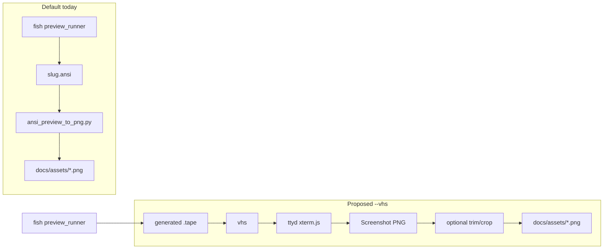

# Phase 12 — Prompt preview VHS backend (color emoji)

| Field | Value |
|-------|-------|
| **Status** | `pending` |
| **Started** | — |
| **Completed** | — |
| **Depends on** | [phase-09-prompt-preview-images.md](../archive/phase-09-prompt-preview-images.md) (completed) |

---

> ## Completion workflow
>
> When **every** checkbox in this document is done:
>
> 1. Set **Status** to `completed` and **Completed** to today's date.
> 2. Add a **Done notes** section (brief: PR links, caveats, follow-ups).
> 3. Update the phase row in [docs/README.md](../README.md).
> 4. Run: `git mv docs/backlog/phase-12-prompt-preview-vhs.md docs/archive/phase-12-prompt-preview-vhs.md`
>
> See [.cursor/rules/docs-backlog.mdc](../../.cursor/rules/docs-backlog.mdc).

---

## Goal

Add an optional **VHS** capture backend to the maintainer-only prompt preview generator so committed README PNGs can show **color emoji** (weather ☀️, moon 🌕) and reliable **Nerd Font Powerline** glyphs. Keep the current ANSI→Python default for quick iteration without the VHS stack.

**Not in scope:** Fisher install paths, CI automation, or [Charm Freeze](https://github.com/charmbracelet/freeze) (evaluated and rejected — same SVG single-font limitation as our Python converter; does not fix emoji).

---

## Background — what Phase 9 shipped

[Phase 9](../archive/phase-09-prompt-preview-images.md) (completed 2026-05-31) added maintainer tooling:

| Artifact | Role |
|----------|------|
| [`scripts/generate_prompt_previews.fish`](../../scripts/generate_prompt_previews.fish) | Main entry; isolated temp `HOME`/`XDG_*`; writes PNGs to `docs/assets/prompt-previews/` |
| [`scripts/prompt_preview_appearance.fish`](../../scripts/prompt_preview_appearance.fish) | Tunable Tide styling (segment bg `#444444`, Powerline glyphs, fonts) |
| [`scripts/ansi_preview_to_png.py`](../../scripts/ansi_preview_to_png.py) | **Default backend:** ANSI → SVG → PNG |
| [`scripts/termtosvg_still_to_png.py`](../../scripts/termtosvg_still_to_png.py) | Optional post-processor for `--termtosvg` |
| [`docs/assets/prompt-previews/*.png`](../../docs/assets/prompt-previews/) | 11 committed preview variants |
| Plugin tweaks in [`functions/_tide_report_prompt_helpers.fish`](../../functions/_tide_report_prompt_helpers.fish) | Preview-only leading `…` omission, Powerline sep helper, weather format `%c%t` (no space) |

Preview text comes from [`_tide_report_install_show_preview`](../../functions/_tide_report_prompt_helpers.fish) (also used by the install wizard; wizard still shows leading ellipsis — PNG previews set `_tide_report_preview_omit_leading_ellipsis` via appearance helper).

**Usage today:**

```fish
fish scripts/generate_prompt_previews.fish           # default ANSI backend
fish scripts/generate_prompt_previews.fish --termtosvg
fish scripts/generate_prompt_previews.fish --open
```

---

## Capture backends tried (Phase 9 + planning)

| Backend | Status | Emoji | Powerline | Notes |
|---------|--------|-------|-----------|-------|
| **ANSI → SVG → PNG** (`ansi_preview_to_png.py`) | **Default** | Missing / plain text gap before temp | Mostly OK | Stable framing; no pip deps beyond rsvg/ImageMagick |
| **termtosvg** (`--termtosvg`) | Optional | Uncertain | Clipping/crop issues | Auto venv at `scripts/.preview-venv` |
| **Charm Freeze** (`--execute` / pipe ANSI) | **Rejected** | No | Maybe with `--font.file` | Same SVG `<text>` model as Python; single font only |
| **Charm VHS** | **This phase** | Expected yes | Expected yes | Real terminal via ttyd/xterm.js + headless browser |

---

## Known visual issues (motivation for VHS)

These persist in committed PNGs from the ANSI default path:

1. **Weather / moon emoji** — ANSI pipeline renders monochrome text; weather shows extra space before temp when emoji is missing (`☀️+22°` vs `+22°`).
2. **Powerline left inner cap** — Left github suffix should be grey glyph on black background (`set_color -b black $grey`); has regressed during Phase 9 fixes. May need a Fish-side fix in `__tide_report_powerline_sep` independent of capture backend.
3. **Framing** — termtosvg had extra rows / clipping; ANSI path is tighter.

---

## Why VHS (not Freeze)

- **Freeze** ([`ansi.go`](https://github.com/charmbracelet/freeze/blob/main/ansi.go)) parses ANSI into SVG with one embedded font. Cannot use `"FiraCode Nerd Font Mono, Noto Color Emoji"` fallback chain.
- **VHS** ([README](https://github.com/charmbracelet/vhs)) runs Fish in a PTY → **ttyd** / xterm.js → headless browser canvas → **ffmpeg**. Uses system font fallback; color emoji works with **Noto Color Emoji** installed ([vhs#699](https://github.com/charmbracelet/vhs/issues/699)). Unicode coverage needs recent **ttyd** ([vhs#395](https://github.com/charmbracelet/vhs/issues/395)); preview emojis (☀️, 🌕, 🌤️) are within that set.



---

## Design decisions (from planning, 2026-06-01)

- **`--vhs` is optional** — ANSI Python remains default until VHS outputs are validated and committed PNGs optionally regenerated.
- **Freeze skipped** — focus VHS only for emoji.
- **Maintainer-local** — do not wire into Fisher, CI, or wizard; same contract as Phase 9.
- **Reuse** existing `$preview_runner`, isolated env, and 11-variant loop in `generate_prompt_previews.fish`.

---

## Preview variants (11 PNGs)

Defined in `generate_prompt_previews.fish` as `slug|which|weather_format|units`:

| Slug | which | weather_format | units |
|------|-------|----------------|-------|
| `all-medium-metric` | all | medium | m |
| `all-medium-us` | all | medium | u |
| `github` | github | medium | m |
| `weather-concise-metric` | weather | concise | m |
| `weather-medium-metric` | weather | medium | m |
| `weather-detailed-metric` | weather | detailed | m |
| `weather-concise-us` | weather | concise | u |
| `weather-medium-us` | weather | medium | u |
| `weather-detailed-us` | weather | detailed | u |
| `moon` | moon | medium | m |
| `tide` | tide | medium | m |

---

## Appearance config (current)

From [`scripts/prompt_preview_appearance.fish`](../../scripts/prompt_preview_appearance.fish):

- Terminal letterbox: `_preview_terminal_bg` = `000000`
- Segment bg: `_preview_segment_bg` = `444444`
- Powerline: prefix `\uE0B2`, separator `\uE0B3`, left sep `\uE0B0`, left suffix `\uE0B0`
- Connection: `·` × 20, color `brblack`
- Font (ANSI path): `"FiraCode Nerd Font Mono, Noto Color Emoji"`, size 16

VHS `Set FontFamily` accepts **one** family name (no comma fallback).

---

## VHS quirks and workarounds

| Issue | Mitigation |
|-------|------------|
| [`Screenshot` needs `Output`](https://github.com/charmbracelet/vhs/issues/540) | Use throwaway `Output tmp/throwaway.gif`; delete after run |
| [`Screenshot` timing / “typing from future”](https://github.com/charmbracelet/vhs/issues/414) | `Sleep 500ms` before screenshot; `Sleep 300ms` after |
| `Output` path | Use **relative** paths (absolute paths broke parser in VHS 0.10.0) |
| Full viewport capture | Tune `Set Height` (~80px) and/or post-crop with ImageMagick `-trim` |
| Deps | **vhs**, **ttyd**, **ffmpeg**; Chromium via go-rod; Nerd Font + **Noto Color Emoji** on host |

---

## Checklist

- [ ] **12.1** **Spike VHS locally** (before code changes)
  - Install: `vhs`, `ttyd`, `ffmpeg`, `noto-fonts-emoji` (or distro equivalent), Nerd Font; run `fc-cache -fv`.
  - Hand-write one `.tape` for `all-medium-metric`; compare to [`docs/assets/prompt-previews/all-medium-metric.png`](../../docs/assets/prompt-previews/all-medium-metric.png).
  - Spike `moon` and `weather-medium-metric` before wiring all 11.
  - Record spike outcome in **Done notes** (emoji OK? Powerline? crop?).

- [ ] **12.2** **Extend appearance config for VHS**
  - Add `_preview_vhs_font_family`, `_preview_vhs_font_size`, `_preview_vhs_width`, `_preview_vhs_height`, theme JSON (or builder from existing `_preview_*` colors).
  - VHS font family: single name, e.g. `FiraCode Nerd Font Mono`.

- [ ] **12.3** **Tape template**
  - Add [`scripts/prompt_preview_vhs.tape.template`](../../scripts/prompt_preview_vhs.tape.template) with placeholders: `{{THROWAWAY_GIF}}`, `{{RUNNER}}`, `{{WHICH}}`, `{{WFMT}}`, `{{UNITS}}`, `{{PNG_OUT}}`, `{{HOME}}`, `{{XDG_*}}`, etc.
  - Pattern: `Hide` → `clear` → one-shot `fish --no-config $preview_runner …` → `Sleep` → `Screenshot` → `Sleep`.
  - Example spike tape skeleton:

    ```elixir
    Output tmp/throwaway.gif
    Require fish
    Set Shell fish
    Set FontFamily "FiraCode Nerd Font Mono"
    Set FontSize 16
    Set Width 1100
    Set Height 80
    Set Padding 0
    Set CursorBlink false
    Set Theme {"background":"#000000","foreground":"#d0d0d0","cursor":"#d0d0d0","black":"#000000","brightBlack":"#444444","cyan":"#5fafaf","brightCyan":"#5fafaf","blue":"#0087af","white":"#ffffff"}
    Hide
    Env TERM xterm-256color
    Env HOME {{HOME}}
    Type "clear"
    Enter
    Type "fish --no-config {{RUNNER}} {{WHICH}} {{WFMT}} {{UNITS}}"
    Enter
    Sleep 500ms
    Screenshot {{PNG_OUT}}
    Sleep 300ms
    ```

- [ ] **12.4** **Wire `--vhs` in generator**
  - `argparse v/vhs` in [`scripts/generate_prompt_previews.fish`](../../scripts/generate_prompt_previews.fish).
  - Preflight: `vhs`, `ttyd`, `ffmpeg` on `PATH`; warn via `fc-list` if Nerd Font / Noto Color Emoji missing.
  - Per slug: render template → run `vhs` → delete throwaway gif.
  - Backend order: `--vhs` → VHS; `--termtosvg` → termtosvg; else ANSI Python.

- [ ] **12.5** **Post-crop (if spike needs it)**
  - Optional [`scripts/vhs_preview_postcrop.py`](../../scripts/vhs_preview_postcrop.py) or ImageMagick `-trim` step behind `--vhs` only.

- [ ] **12.6** **Documentation**
  - Update README maintainer lines (~18 and ~250): `--vhs`, install stack, when to use vs default.
  - Clarify VHS not shipped by Fisher; not run in CI.

- [ ] **12.7** **Hygiene (optional)**
  - `.gitignore`: `docs/assets/prompt-previews/_debug*.png`
  - Fix temp cleanup in generator (`builtin rm` if `command rm` fails due to shell alias).

- [ ] **12.8** **Verification**
  - `fish -n scripts/generate_prompt_previews.fish`
  - `fish scripts/generate_prompt_previews.fish --vhs` → 11 PNGs
  - Visual: `all-medium-metric`, `moon`, `weather-medium-metric`
  - `fish scripts/run_tests_isolated.fish`

- [ ] **12.9** **Regenerate committed PNGs (optional follow-up)**
  - Only after visual sign-off; separate commit from tooling if desired.

---

## Trade-offs

| | ANSI Python (default) | VHS (`--vhs`) |
|--|----------------------|---------------|
| Color emoji | No | Yes (with Noto Color Emoji) |
| Powerline PUA | Fragile | Yes (Nerd Font via `Set FontFamily`) |
| Maintainer deps | Python, rsvg/ImageMagick | vhs, ttyd, ffmpeg, Chromium |
| Speed | Fast | Slow (browser per variant) |
| CI | Light | Heavy — keep maintainer-local |
| Determinism | High | Medium (Sleep workarounds) |

---

## Decision matrix (after spike)

| Outcome | Action |
|---------|--------|
| Emoji + Powerline good; crop OK | Ship `--vhs`; optionally regenerate committed PNGs |
| Emoji good; crop bad | Add post-crop; retune `Set Height` |
| Fonts still broken | Check ttyd version + `fc-cache`; consider hybrid overlay (new backlog item) |
| Too heavy / flaky | Keep ANSI default; document VHS as optional only |

---

## Acceptance criteria

- `fish scripts/generate_prompt_previews.fish --vhs` produces 11 PNGs when vhs/ttyd/ffmpeg and fonts are installed.
- `--vhs` is optional; default path unchanged.
- README documents VHS deps and usage.
- No Fisher install surface change; tests pass.

---

## Key files

- [`scripts/generate_prompt_previews.fish`](../../scripts/generate_prompt_previews.fish)
- [`scripts/prompt_preview_appearance.fish`](../../scripts/prompt_preview_appearance.fish)
- [`scripts/ansi_preview_to_png.py`](../../scripts/ansi_preview_to_png.py) (unchanged default)
- [`functions/_tide_report_prompt_helpers.fish`](../../functions/_tide_report_prompt_helpers.fish)
- [`docs/assets/prompt-previews/`](../../docs/assets/prompt-previews/)
- [`README.md`](../../README.md) (Previews + Development sections)
- New: `scripts/prompt_preview_vhs.tape.template`
- New (maybe): `scripts/vhs_preview_postcrop.py`

---

## Out of scope

- Charm Freeze integration
- CI / Docker VHS (`ghcr.io/charmbracelet/vhs`) unless explicitly requested later
- Hybrid emoji compositing on ANSI PNGs (fallback if VHS spike fails)
- Left Powerline cap Fish fix (do in same PR only if still broken after VHS spike)

---

## Done notes

_(Fill when completed.)_

**Planning context (2026-06-01):** Cursor plan `try_freeze_backend` evolved from Freeze evaluation → VHS for emoji; user chose VHS-only, optional `--vhs` flag, ANSI default until validated. Phase 9 archived; uncommitted working tree may still contain Phase 9 script/assets changes from that session — reconcile with git before starting implementation.
